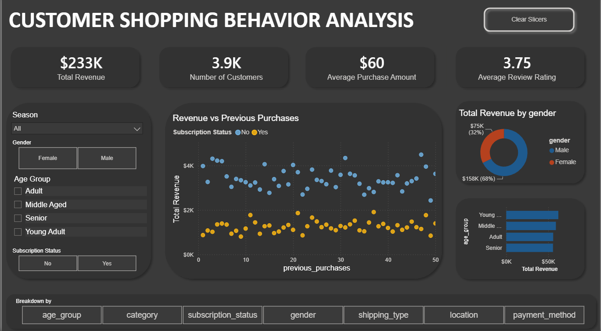

# Customer Shopping Behavior Analysis

End-to-end data analysis project covering data cleaning, SQL analysis, and an interactive Power BI dashboard, built on a customer shopping behavior dataset (3,900 records, 18 attributes).

## 🎯 Objective
Analyze customer purchasing patterns to uncover insights on revenue drivers, customer segments, subscription behavior, and product performance.

## 🛠️ Tools Used
- **Python (Pandas)** — data cleaning and preprocessing
- **MySQL** — data storage and analytical queries
- **Power BI** — interactive dashboard and visualization

## 📁 Project Structure
- `notebooks/` — Jupyter notebook with data cleaning (missing value imputation, column standardization, feature engineering)
- `sql/` — SQL queries for business analysis
- `powerbi/` — Power BI dashboard file and screenshot
- `data/` — raw dataset

## 🧹 Data Cleaning (Python/Pandas)
- Filled missing review ratings using category-level median
- Standardized column names to snake_case
- Removed redundant `promo_code_used` column (fully duplicate of `discount_applied`)
- Engineered `age_group` (quantile-based binning) and `purchase_frequency_days` (mapped from purchase frequency text)

## 🔍 SQL Analysis
Key business questions answered via SQL, including:
- Revenue by gender
- High-spending discount users
- Top-rated products
- Subscriber vs. non-subscriber spending comparison
- Customer segmentation (New/Returning/Loyal) by purchase history
- Top 3 products per category (window functions)
- Revenue contribution by age group

See [`sql/customer_shopping_behavior.sql`](sql/customer_shopping_behavior.sql) for all queries.

## 📊 Power BI Dashboard
Interactive single-page dashboard featuring:
- KPI cards (Total Revenue, Customers, Avg Purchase Amount, Avg Review Rating)
- **Dynamic Field Parameter** — switch the main chart's breakdown between Category, Season, Age Group, Gender, Payment Method, Shipping Type, and Location on the fly
- Scatter plot — Revenue vs. Previous Purchases, segmented by Subscription Status
- Donut chart — Revenue by Gender
- Interactive slicers (Season, Gender, Age Group, Subscription Status) with a bookmark-powered reset button

## 💡 Key Insights
- Male customers contribute ~68% of total revenue despite being close to an even gender split in customer count.
- Subscription status shows no strong correlation with revenue at any previous-purchase level.
- Revenue is nearly evenly distributed across age groups ($55K–$62K each), with Young Adults leading slightly at $62,143 — indicating no single age segment dominates the customer base.
- Gloves, Sandals, and Boots are the highest-rated products (avg. 3.82–3.86/5), suggesting accessories and footwear categories drive stronger customer satisfaction than the overall average rating of 3.75.

## 🚀 How to Reproduce
1. Clone this repo
2. Run the notebook in `notebooks/` to clean the raw dataset
3. Load cleaned data into MySQL and run queries in `sql/`
4. Open `powerbi/dashboard.pbix` in Power BI Desktop to explore the dashboard